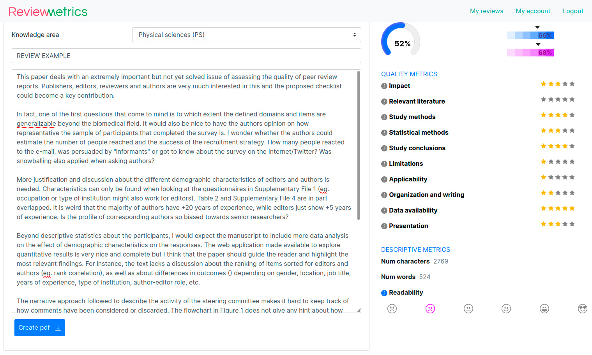

# ReviewMetricsApp
quantitatively describe review reports --> https://reviewmetrics.uv.es/

ReviewMetrics aims to quantitatively describe review reports on scientific manuscripts, thus helping to get recognition for your reviewing task and to check how complete and aligned with the community your review text is.

Measure the completeness of your review reports by checking for the presence of +10 textual dimensions in a comprehensive, dynamic and visual way.

